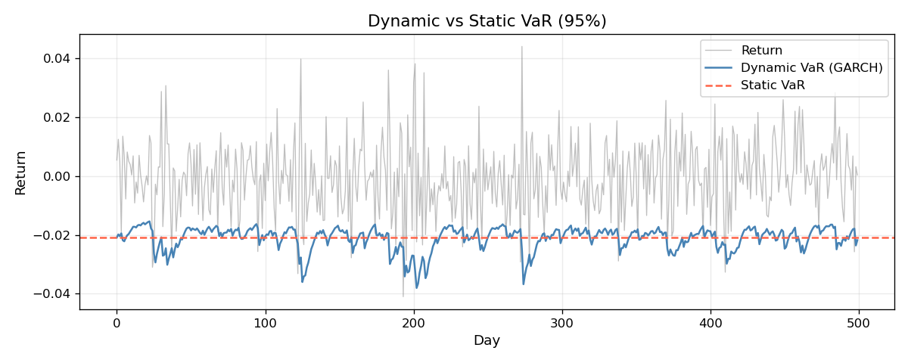

# GARCH Volatility Modeling

GARCH(1,1) model fitted by MLE on daily equity returns, with application to dynamic VaR estimation.

Motivated by a limitation in my [portfolio-risk-VAR-ES](https://github.com/mezaouifinance/portfolio-risk-VAR-ES) project: the parametric VaR assumes constant volatility, which is clearly wrong for financial returns (volatility clusters).

---

## Model

The GARCH(1,1) conditional variance:

```
sigma^2_t = omega + alpha * epsilon^2_{t-1} + beta * sigma^2_{t-1}
```

Parameters estimated by maximum likelihood under Gaussian innovations.
Stationarity requires `alpha + beta < 1`.

---

## Installation

```bash
git clone https://github.com/mezaouifinance/garch-volatility.git
cd garch-volatility
pip install -r requirements.txt
```

---

## Usage

```python
from src.data import load_returns
from src.garch import fit, conditional_variance, half_life
from src.var_forecast import static_var, dynamic_var

returns = load_returns("SPY", start="2018-01-01")

omega, alpha, beta = fit(returns)
print(f"alpha={alpha:.3f}, beta={beta:.3f}, half-life={half_life(alpha, beta):.1f} days")

# Compare static vs dynamic VaR
sv = static_var(returns, alpha=0.95)   # constant vol assumption
dv = dynamic_var(returns, alpha=0.95)  # GARCH conditional vol
```

Run the full analysis on SPY:

```bash
python analysis.py
```

### Dynamic vs static VaR



The GARCH-based dynamic VaR (orange) reacts to volatility clusters, tightening during calm periods and widening during stress. The static VaR (dashed blue) remains constant and consistently misprices tail risk.

---

## Tests

```bash
pytest tests/ -q
```

Tests cover: MLE stationarity constraint, conditional variance positivity, VaR shape, Kupiec POF test structure.

---

## Project structure

```
garch-volatility/
├── src/
│   ├── data.py          # yfinance data loading
│   ├── garch.py         # GARCH(1,1) MLE, conditional variance
│   ├── var_forecast.py  # static vs dynamic VaR
│   └── diagnostics.py   # Ljung-Box, Kupiec POF test
├── tests/
│   └── test_garch.py
├── analysis.py          # full pipeline on SPY
├── requirements.txt
└── .github/workflows/ci.yml
```
